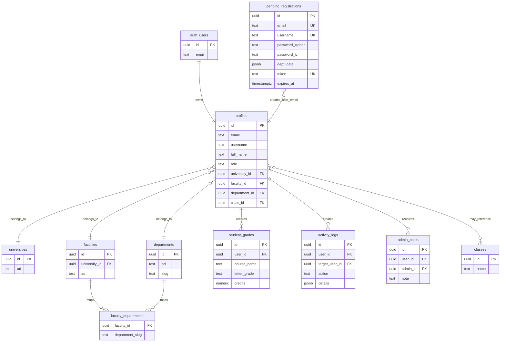

# UniPulse Schema Diagram

This diagram reflects the schema visible from the repository migrations and active application code. The full hosted Supabase schema should be exported separately before deleting or renaming tables such as `classes`.

